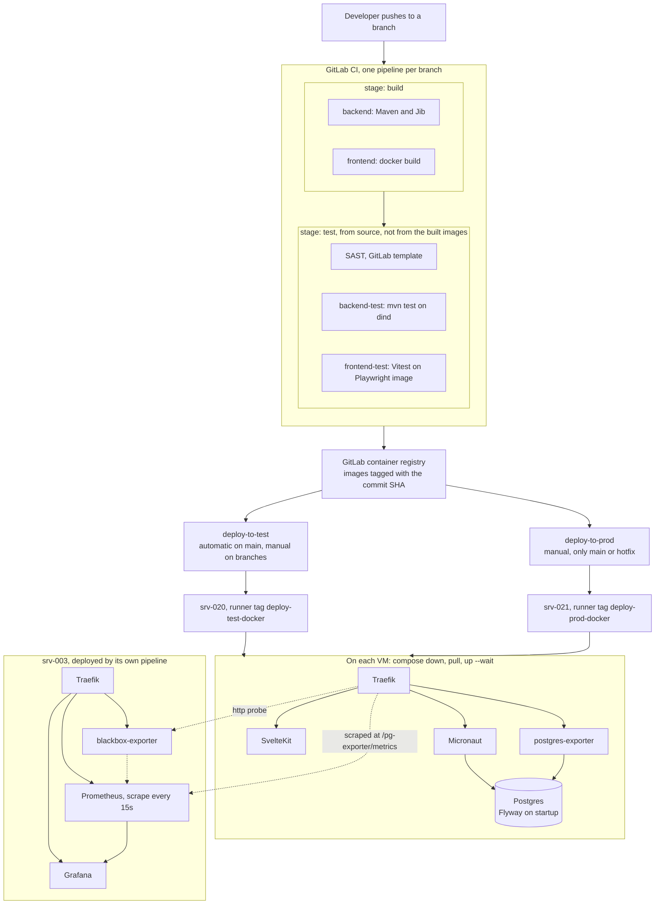
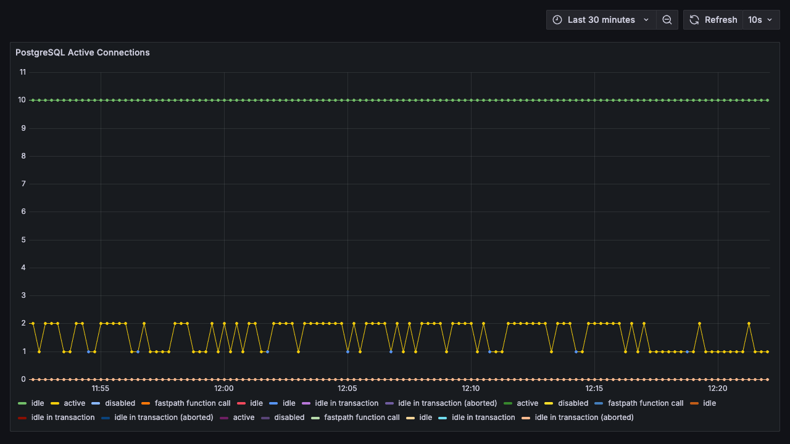

# g01-devops

A small web application carried through a complete delivery chain: commit,
build, image registry, two deployed environments, and monitoring on top. Built
by a group of four during the DevOps module at HSLU, autumn semester 2025.

The application itself is deliberately trivial, a newsletter form that stores
three fields in Postgres. It exists so that the pipeline around it has
something real to move. What is worth reading here is that pipeline, the
deployment, and the honest record of what was built and what was not.

## The problem

The module asked for a delivery chain rather than a product. Every group was
given lab VMs and a GitLab instance, and had to get from a commit to a running
application without manual steps, across a test and a production environment,
with the state of both visible from outside.

That framing set the constraints. The application had to be small enough to
stop being the interesting part. The environments had to differ in more than
name. And the pipeline had to be the artefact, not a means to an end.

## Architecture

Three repositories, kept as directories here so the parts can be read
together: [`g01-form`](g01-form) is the application and its pipeline,
[`g01-monitoring`](g01-monitoring) is the Prometheus and Grafana stack,
[`g01-documentation`](g01-documentation) is the module report. Each has its own
readme covering how that part is built and run.
[`devops-stack`](devops-stack) is not part of the coursework and is explained
further down.



### Where it breaks

The interesting parts of a pipeline are its failure modes. These are the ones
this design has, read out of the configuration rather than assumed.

| Stage        | What happens when it fails                                                                                                                                                                                                                                    |
| ------------ | ------------------------------------------------------------------------------------------------------------------------------------------------------------------------------------------------------------------------------------------------------------- |
| Build        | The job fails and nothing is pushed. The previous image stays deployed, because deployment is a separate stage that is not reached.                                                                                                                           |
| Tests        | Same, with one exception: on branches matching `hotfix*` both test jobs are set to `allow_failure`, so a hotfix can reach deployment with failing tests. That is a deliberate trade, and it is the kind of thing worth defending out loud rather than hiding. |
| Registry     | Images are tagged with `CI_COMMIT_SHA`, never `latest`, so a deploy always names exactly one build.                                                                                                                                                           |
| Deploy       | This is the weak point. The job runs `compose down` before `compose up`, so the old version is stopped first. If the new one fails to become healthy within 180 seconds, the environment stays down. There is no rollback.                                    |
| Startup      | Postgres has a readiness check, the backend has an HTTP healthcheck, and `up --wait` fails the job if either does not come up. The frontend has no healthcheck, so a broken frontend deploys as successful.                                                   |
| Migration    | Flyway runs inside the backend on startup. A failing migration fails the container, which fails the healthcheck, which fails the job. There is no down migration.                                                                                             |
| After deploy | Nothing verifies that the application works, only that its containers are healthy. There are no smoke tests.                                                                                                                                                  |

## Decisions and why

**Two environments driven by branch rules, not by separate pipelines.** Test
deploys automatically from `main` and manually from feature, bugfix and hotfix
branches. Production is manual and reachable only from `main` or a hotfix. The
rules live in `g01-form/gitlab/utils.yml` as named fragments and are referenced
by the jobs, so the promotion policy is one file rather than a condition
duplicated across jobs.

**Images tagged with the commit SHA.** Deployment then names one specific
build, and the same tag can be redeployed. It is also the only reason a manual
rollback is possible at all: re-run the deploy job of an older pipeline.

**Jib for the backend, a Dockerfile for the frontend.** Jib builds and pushes
the Java image straight from Maven without a Docker daemon, which removes
dind from the backend build. The frontend needs a real build step, so it keeps
a normal multi-stage Dockerfile.

**Traefik in front of both services.** The frontend calls the backend at the
relative path `/api`, so both are served from one origin and there is no CORS
in production. `application-prod.properties` disables CORS entirely, while the
local profile allows the Vite dev server. Routing priorities do the split:
`/api` at priority 100, everything else at priority 1.

**Feature flags through the GitLab Unleash API.** The form deliberately
contains a ten second delay that is switched off by the flag `fixloading`. It
is a demonstration of decoupling a release from a deployment, and it is the one
piece of the system that behaves differently depending on something outside the
repository.

**Blackbox probes in addition to exporter metrics.** The Postgres exporter says
whether the database is busy. The blackbox exporter says whether a user could
have reached the site. Both were wanted, because the first cannot answer the
second.

## Running it locally

The VMs this was deployed to are inside the HSLU lab network and are no longer
reachable, so nothing in `g01-form` or `g01-monitoring` can be started as
written. `devops-stack` was added afterwards, for this repository rather than
for the module, and collapses the three hosts onto one machine.

```bash
cd devops-stack
docker compose up -d --wait
```

Then open http://localhost:8081 for the form and http://localhost:8081/grafana
for the dashboard. It needs Docker and nothing else. See
[devops-stack/README.md](devops-stack/README.md) for what it replaces and what
it cannot show.

The dashboard below is the one from `g01-monitoring`, unmodified, reading from
the local stack. The flat line at ten is idle connections held by the
connection pool, the oscillating one is queries actually running.



## Limits

Stated plainly, because a named gap is worth more than a vague claim.

**No rollback.** Nothing in the pipeline restores a previous version, and the
deploy stops the old one before starting the new one. Re-running an older
pipeline is the only path back, and it was never exercised.

**No alerts.** Prometheus scrapes and Grafana displays, but there are no
alerting rules, no Alertmanager and no notification path. One dashboard with
one panel exists. Nothing draws attention to a problem by itself.

**No backup.** There is no dump, no restore procedure and no recovery test. The
database survives a redeploy only because the compose volume is named and
`down` is called without `-v`.

**Secrets are CI variables written to a file.** The deploy job writes a `.env`
onto the target VM with a heredoc and lets compose read it. It works and it
keeps credentials out of the repository, but there is no secret store, no
rotation, and the file is not cleaned up afterwards.

**Traefik holds the Docker socket.** Mounted read only, which is still enough
to be equivalent to root on the host. It is the standard Traefik setup and it
is a real trade, not an oversight to be glossed over.

**Postgres is published on the host in both environments.** Only the backend
needs it, and it shares a network with the backend, so the published port is
unnecessary exposure.

**Not everything is pinned.** The application images are pinned by commit SHA,
and most infrastructure images carry exact tags. The monitoring stack does not:
`prom/prometheus:latest` and `grafana/grafana-oss:latest` mean the stack that
ran in December is not the stack that would come up today. `postgres:16`,
`node:22-alpine` and `maven:3.9-eclipse-temurin-21` follow moving minor tags,
and the Jib base image is not specified at all. No image is pinned by digest.

## Contributors

Group work by four students: Bleron Hajdini, Lukas Schmid, Nevilan Sabanathan
and Gabriel Buckland.

My own share was the frontend and the monitoring stack, together with part of
the CI configuration, the compose files and the module report. The backend and
most of the written documentation were the work of the others. `git blame`
gives the split file by file for anyone who wants it.

## Status

Coursework, completed December 2025, not maintained. The GitLab project, the
container registry, the runners and the four lab VMs are inside the HSLU
network and are no longer accessible to me, which is why this repository
contains no pipeline badge and no links to a live environment. The pipeline
configuration is the one that ran; the runs themselves cannot be shown.
